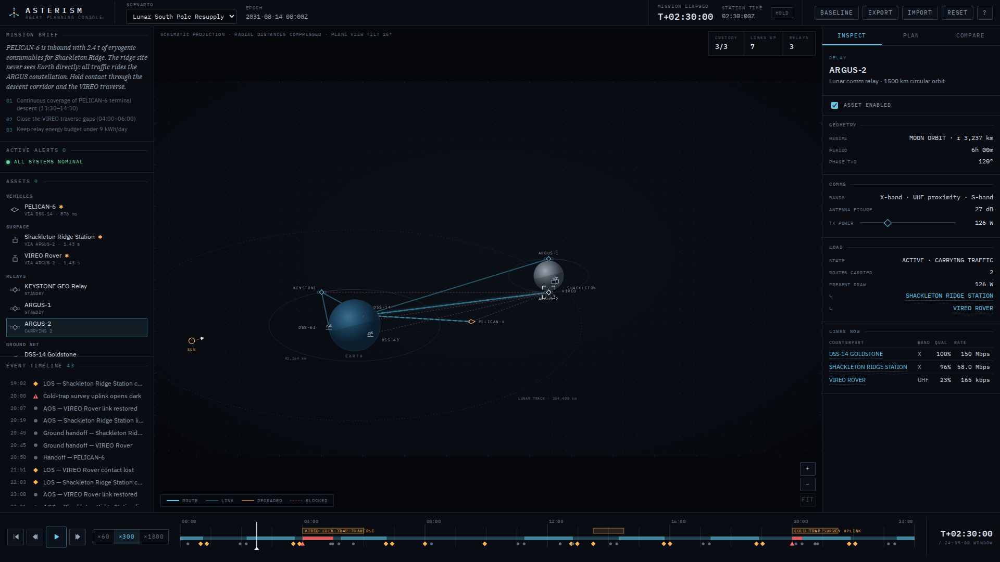

# Asterism — Relay Planning Console

Asterism is a deep-space communications planning console. A mission operator
uses it to explore a simulated 24-hour window, watch relay geometry and link
quality evolve, edit the relay plan — deploy, tune, disable, decommission —
and score every change against a saved baseline.

It is a planning instrument, not an orbital-mechanics package: the model is
deliberately simplified, but it is deterministic, internally consistent, and
every number on screen is computed from the same underlying calculations.



## Features

- **Mission visualization** — a tilted schematic plan view (SVG) of Earth,
  the Moon, Mars, relay constellations, surface sites and transfer vehicles.
  Active links, storm-degraded links, blocked paths and full relay routes are
  drawn live. Assets and links are selectable directly on the map; the view
  pans and zooms.
- **Time controls** — scrub the 24 h window, play/pause at ×60/×300/×1800,
  jump between mission events, return to scenario start. Positions, links,
  routes, metrics and alerts all respond to the clock.
- **Inspectors** — per-asset geometry, comms fit, live link table, route to
  Earth with per-hop chips, upcoming passes and windows; per-link distance,
  latency, rate, reliability and a full link-budget breakdown. Inspectors
  carry working controls: enable/disable, TX power, orbit phase (operator
  relays), preferred-relay pinning, rename, decommission.
- **Relay-plan editing** — deploy up to six operator relays into
  scenario-specific regions with a live "pending deploy" ghost on the map,
  name them, set phase and power, toggle or remove them. Validation rejects
  duplicate designations, out-of-range power, bad phases and over-budget
  deployments.
- **Baseline comparison** — capture the working plan, then see coverage,
  latency, reliability, energy, uncovered critical windows and relay count
  diffed with direction-aware improved/worse verdicts, paired bars, stacked
  24 h coverage strips, and a plain-language summary.
- **Three scenarios** — Lunar South Pole Resupply, Mars Transfer Handoff,
  Solar Storm Contingency. Different assets, regions, constraints, events
  and failure modes (see below).
- **Events & alerts** — derived AOS/LOS transitions (bisection-refined to
  ~seconds), route handoffs, ground-station rotations, storm phases,
  degradations, and mission windows that open uncovered. Clicking an event
  seeks the clock and selects the affected asset. Severity is encoded with
  shape + text, never color alone.
- **Persistence & portability** — the working state autosaves to
  `localStorage` per scenario; export/import a versioned JSON envelope with
  precise, human-readable validation errors on rejection.

## Running it

```bash
npm install
npm run dev        # development server on http://localhost:5173
```

Production build and preview:

```bash
npm run build      # typecheck + bundle to dist/
npm run preview    # serve the production build on http://localhost:4173
```

Everything is local: no backend, no accounts, no API keys, no network access
needed after `npm install` (fonts are bundled).

## Tests

```bash
npm test           # Vitest unit suite (simulation, routing, metrics, store, import)
npm run e2e        # Playwright browser suite (builds, serves, runs workflows)
npm run e2e:screenshots   # regenerate artifacts/screenshots/*
```

The Playwright suite drives the real production build: the full operator
workflow (scenario select → gap event → relay deploy → metric change →
baseline compare → JSON export), import rejection, keyboard control,
scenario switching, map-level selection, and persistence across reloads.
First-time Playwright setup on a fresh machine may require
`npx playwright install chromium`.

## Architecture

```
src/
  sim/          pure deterministic model — no React, fully unit-tested
    positions.ts  body/asset kinematics (orbits, spin, transfers)
    links.ts      band matching, line of sight, storm geometry, link budget
    routing.ts    Dijkstra from the Earth-terminal set, preference biasing
    snapshot.ts   full state of the network at one instant + active alerts
    metrics.ts    24 h sampling → coverage/latency/reliability/energy/windows
    events.ts     derived timeline (AOS/LOS/handoffs/gaps) + scripted beats
  scenarios/    three seeded scenario definitions (data only)
  state/        zustand store, validation, localStorage persistence,
                versioned import/export envelope
  components/   map/ (SVG visualization), timeline/, panels/ (inspector,
                plan, compare), rail/ (brief, alerts, roster, events),
                shell/ (header, dialogs, toasts, shortcuts, clock)
  styles/       design tokens + per-region stylesheets
e2e/            Playwright specs (workflow + screenshot generation)
scripts/        dev-only calibration report (npx vite-node scripts/report.ts)
```

State flows one way: scenario definition + plan (user edits) + time →
`computeSnapshot` → everything on screen. 24 h metrics and the event
timeline are cached on `(scenario, plan)` identity, so scrubbing time is
cheap and editing the plan recomputes exactly once.

## Simulation model

The model favors legibility over fidelity. The key relationships:

- **Geometry** is 2-D and coplanar. Bodies spin; the Moon orbits Earth
  (tidally locked); Mars sits at a fixed range over one day; satellites fly
  circular orbits; transfer vehicles follow a bowed chord with progress
  interpolated across the window.
- **Line of sight** requires no body-disc occlusion (segment/circle test
  with a small margin) and, for surface assets, the target above a 6°
  horizon mask.
- **Link budget (toy units)** —
  `score = (10·log₁₀P₁+G₁) + (10·log₁₀P₂+G₂) − 20·log₁₀(d/1000 km) + band
  − storm − health − noise floor`, mapped through a smoothstep to a 0–1
  quality. Links are usable above 6 dB and saturate at 30 dB. The link
  inspector shows this exact breakdown per link.
- **Storms** apply a time-ramped attenuation weighted by how closely the
  link axis aligns with the sun vector, reduced by per-asset shielding —
  so hardened relays and cross-sun paths survive while sunward direct links
  fade.
- **Routing** is Dijkstra over available links from the Earth ground
  network outward, with cost = latency + hop cost + unreliability penalty.
  Pinning a preferred relay discounts its links rather than forcing them,
  so preferences can never create invalid routes.
- **Metrics** sample the day at 5-minute steps: coverage is the fraction of
  samples each critical asset holds a route; energy integrates relay TX
  power (full draw while carrying traffic, 12% idle beacon otherwise);
  a mission window counts as uncovered if any sample inside it is dark.

### Known simplifications

- Coplanar 2-D geometry — no inclinations, no polar orbits; a lunar
  "south-pole" site is represented as a limb site that never sees Earth.
- The link budget uses tuned toy constants, not physical EIRP/G-T figures;
  path loss compresses real dynamic range so lunar and Mars regimes are
  both interesting.
- Reliability, bandwidth and energy are simple deterministic functions of
  quality, health and power — no fading statistics or queueing.
- Mars is fixed in the mission frame for the 24 h window (its real motion
  in a day is negligible at this scale) and planet positions are not
  ephemeris-accurate.
- The displayed map is a schematic projection: radial distances are
  log-compressed per body and the plane is drawn at a 25° tilt. Physics
  (distances, latency, occlusion) always uses the physical frame, never
  display coordinates.

## The three scenarios

| | Challenge |
|---|---|
| **Lunar South Pole Resupply** | The ridge station and rover can only reach Earth through ARGUS relay passes; seeded gaps leave the rover traverse and survey uplink dark. Close them with a third relay or smarter phases — under an energy budget. |
| **Mars Transfer Handoff** | ~12-minute light time. MULE-2 approaches Mars on thin Earth-direct X-band while the MARINER trunk suffers a star-tracker fault mid-window. |
| **Solar Storm Contingency** | An S3 event sits on the Earth–Moon line for seven hours. Only the hardened BASTION trunk holds; two crew EVAs fall inside the storm. |

## Keyboard shortcuts

| Key | Action |
|---|---|
| `Space` | Play / pause |
| `←` / `→` | Step ±5 min (`Shift` = ±1 h) |
| `Home` | Return to scenario start |
| `E` / `Shift+E` | Next / previous event |
| `1` `2` `3` | Playback ×60 / ×300 / ×1800 |
| `S` | Capture baseline |
| `I` `P` `C` | Inspector / Plan / Compare tab |
| `Esc` | Clear selection / close dialog |
| `?` | Shortcut reference |

## Persistence and import/export

Per-scenario working state (plan, baseline, clock) autosaves to
`localStorage` under `asterism.v1.*`; **Reset** restores the seeded
scenario. **Export** downloads a versioned envelope:

```json
{ "format": "asterism.plan", "version": 1, "scenarioId": "…",
  "timeS": 0, "plan": { … }, "baseline": { … } | null }
```

**Import** accepts a file or pasted JSON and deep-validates it — wrong
format/version, unknown scenarios or regions, duplicate ids, malformed
fields are all rejected with specific messages; out-of-range numeric values
are clamped rather than trusted.

## Screenshots

Generated from the running production build by `npm run e2e:screenshots`
into `artifacts/screenshots/`:

- `asterism-main-1920x1080.png` — lunar scenario mid-mission, relay inspected
- `asterism-edited-plan-1920x1080.png` — deployed relay + baseline comparison
- `asterism-main-1366x768.png` — compact desktop layout
- `asterism-mars-transfer-1920x1080.png`, `asterism-solar-storm-1920x1080.png`

## Limitations

- 2-D geometry limits orbit variety (no inclined/elliptical orbits) and the
  pole-site analogy is stylized.
- Route planning is instantaneous-best-path per time sample; it does not
  schedule ahead or model contact-graph routing.
- The scrubber quantizes metric strips to the 5-minute sampling grid (event
  times themselves are refined to ~2 s).
- Undo covers destructive actions (decommission, restore-plan) via toast
  actions; there is no full multi-step edit history.
